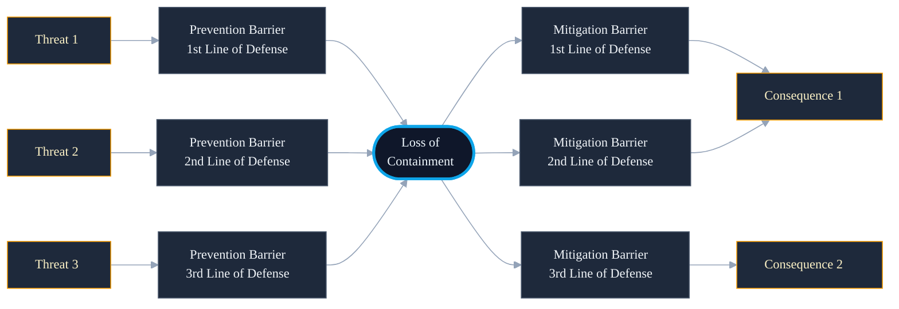

<!--
chapter: 1
title: The Problem
audience: Process safety domain expert evaluator + faculty supervisor
last-verified: 2026-04-25
wordcount: ~563 (approved sections 1–5); ~625 including closing reference block
-->

# Chapter 1 — The Problem

## What static analysis leaves unanswered

Process safety engineers identify barriers, place them on prevention or mitigation pathways, and assign each a line of defense. What this work cannot do is condition one barrier's reliability assessment on another barrier's failure — or learn, from the incident record, which configurations actually failed.

Bowtie methodology gives the structure. It does not answer the next question: given that this prevention barrier has failed, which mitigation barrier is now most at risk? That question is empirical. It requires a corpus of real incident investigations, structured barrier-level failure records, and enough volume to see patterns recur.

The chapters that follow argue for one answer. This chapter establishes the question.

## Loss of Containment as a tractable scope

Scoping to Loss of Containment is a precision choice. A single top event type gives the corpus a common structure: identifiable prevention and mitigation barriers, documented failure outcomes, and a shared structural vocabulary across incidents regardless of operator or jurisdiction.

Without that constraint, barrier vocabulary fragments. A pressure relief device fails differently than a procedural administrative control, and structural features — type, line of defense, pathway position — only carry signal when the underlying scenarios share enough topology to make comparison valid.

The cascading corpus here is 813 pair-feature training rows from 156 BSEE+CSB incident investigations (530 single-barrier rows before the prevention→mitigation cross-join).

## Prevention, mitigation, and line of defense as structural features

Where a barrier sits in the bowtie encodes its causal role: prevention barriers interrupt threat pathways before Loss of Containment occurs; mitigation barriers limit consequences after. That distinction is not taxonomic — it reflects whether a barrier is blocking the cause or absorbing the effect.

Within each side, line of defense assigns depth. Two barriers of the same type at different lines of defense occupy structurally different positions in the scenario, even when their nominal function is similar.

Barrier type and line of defense are categorical systems aligned with CCPS process safety standards rather than ad-hoc labels (Fidel Comment #56). Together, these structural properties are how the model represents how barriers relate to each other and to the top event.

---

---

## Conditioning on observed failure: the cascading question

A single-barrier failure probability treats each barrier as independent. In a Loss of Containment scenario, that assumption fails: when one barrier collapses, every barrier downstream operates in a degraded context that the single-barrier model does not represent.

Cascade framing (Khakzad 2013, 2018) addresses this directly. One barrier is designated as failed at inference; the model produces failure-conditioned risk estimates for every other barrier in the scenario. The question changes: not "how likely is this barrier to fail," but "how likely is it to fail given that another has already failed."

The 813 training pairs encode this relationship across 156 incidents — each pair representing the failure-conditioned risk of one target barrier given another barrier's collapse.

## What this chapter establishes — and what it defers

The vocabulary is now in place: prevention and mitigation as causal direction, line of defense as depth, CCPS barrier type as the categorical anchor, and pair-feature cascade framing as the predictive structure. The chapters that follow build on each element in sequence.

Two questions this chapter explicitly defers: whether 813 training pairs from 156 incidents is sufficient volume for the generalization the model claims, and whether the BSEE+CSB corpus captures the LOC incident distribution broadly rather than the US-regulatory reporting record. Chapter 3 addresses the first through GroupKFold cross-validation and per-fold variance. Chapter 2 addresses the second through corpus design decisions.

The framing is tractable. Whether the evidence supports it is the argument that follows.

---

## What this chapter buys

- The research question: which barrier fails conditioned on another's failure
- LOC as a tractable scope: single top event, structural consistency across incidents
- Prevention/mitigation as causal direction relative to the top event
- Line of defense as structural depth within each pathway side
- CCPS barrier type taxonomy anchored in process safety standards

## What this chapter doesn't buy

- Whether 813 training pairs is sufficient generalization volume (→ Ch 3)
- Whether BSEE+CSB represents global LOC incidents (→ Ch 2)
