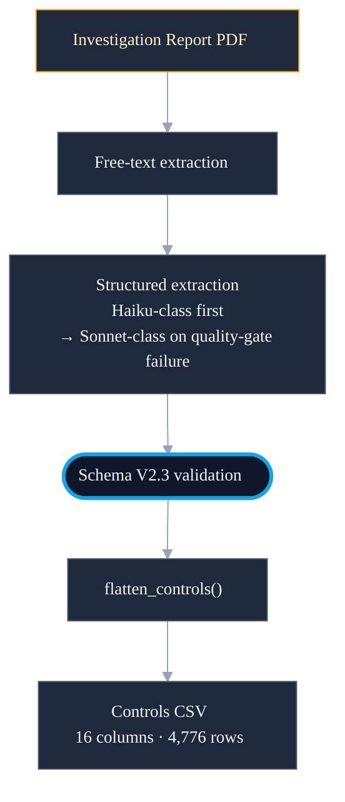

<!--
chapter: 2
title: From Investigation Reports to Training Rows
audience: Process safety domain expert evaluator + faculty supervisor
last-verified: 2026-04-26
wordcount: ~830
-->

# Chapter 2 — From Investigation Reports to Training Rows

## Why public investigation reports, not standard ML datasets

Standard ML benchmark repositories supply labeled datasets. For barrier failure prediction in oil and gas Loss of Containment scenarios, no such corpus exists on any benchmark repository or industry data exchange. Barrier-level failure labels require two things that standard incident databases do not supply: documentation of which barriers were present when containment was lost, and a post-investigation determination of whether each one performed. Both pieces of evidence are produced only once — inside a mandatory regulatory investigation report.

Two agencies produce reports with the structural detail this work requires: BSEE for offshore oil and gas incidents under United States jurisdiction, CSB for onshore chemical and refining. Their reports are public. The work begins with PDFs.

*Source grounds: `src/ingestion/sources/` (active discovery modules: bsee, csb); CLAUDE.md §"Data Directories"*

## LLM extraction and the escalation ladder

An investigation report PDF is unstructured prose — findings, causal chains, and barrier assessments distributed across hundreds of pages with no consistent field structure. Converting it to a labeled corpus requires two extraction passes: a free-text pass to recover readable content from the PDF, followed by a structured pass that maps that content against the V2.3 schema.

Structured extraction uses a quality-gated model escalation ladder. The cheapest model — Haiku-class — runs first. If extraction fails on any of five conditions (timeout, rate-limit, empty output, invalid JSON, or schema validation failure), the pipeline retries twice at that tier before promoting to the next. Three-strategy JSON recovery runs before any model surrenders the response as unrecoverable. Promotion advances through progressively stronger Sonnet variants. Most extractions succeed at Haiku-class cost; the fraction that require stronger models pay only the cost they need.

*Source grounds: `src/llm/model_policy.py` (haiku-4-5-20251001 → sonnet-4-20250514 → sonnet-4-5-20250929 → sonnet-4-6; retries_per_model=2; promote_on: 5 conditions); `src/ingestion/structured.py` (extraction orchestrator, `compute_quality_gate()`, three-strategy JSON recovery in `_parse_llm_json()`)*

## Schema V2.3 as the data contract

Every downstream consumer in the pipeline — training, analytics, RAG retrieval — reads against a single validated structure: Schema V2.3. Seven top-level keys encode the extraction result: incident metadata, bowtie structure, threats, controls, consequences, recommendations, and PIFs. Pydantic validation at ingest time enforces the contract; only incidents that pass become part of the corpus.

The corpus currently holds 739 canonical incidents. flatten_controls() converts validated V2.3 JSONs into the controls CSV that training and analytics consume — 16 fixed columns, 4,776 rows across the full corpus. Human factors signal is carried by 12 boolean PIF fields: four People dimensions, four Work dimensions, four Organisation dimensions. Each records whether a contributing factor was mentioned in the investigation report — a detection signal, not a causal rating.

*Source grounds: `src/models/incident_v23.py` (Pydantic V2.3 model, validators); `src/analytics/flatten.py` (`flatten_controls()`, `CONTROLS_CSV_COLUMNS` 16 columns); `data/structured/incidents/schema_v2_3/` (739 canonical JSONs); `data/processed/controls_combined.csv` (4,776 rows); CLAUDE.md §"Key Schema Fields"*

---

---

## Two LoD systems: the schema-evolution artifact

Line-of-defense encoding differs by pipeline stage. Schema V2.3 carries line_of_defense as a 5-class ordinal: "1st", "2nd", "3rd", "recovery", or "unknown" — the categories available when investigators classified barrier depth in historical reports. The cascading training CSV carries lod_industry_standard, an 11-category string taxonomy aligned with CCPS process safety standards (10 named categories plus "Other"; "Other" is dropped before cascading training). lod_industry_standard is not a field in Schema V2.3.

The difference is not an inconsistency to correct. Historical incident records were classified against a simple ordinal; scenario-builder inference at runtime requires category alignment with CCPS process safety standards. The two systems serve different precision requirements at different pipeline stages. They coexist because the extraction and inference contracts are not the same contract.

*Source grounds: `src/models/incident_v23.py` (ControlItem.line_of_defense: Literal["1st","2nd","3rd","recovery","unknown"]); `data/models/cascading_input/barrier_model_dataset_base_v3.csv` (lod_industry_standard: 11 values including "Other"); `data/processed/cascading_training.parquet` (10 post-filter values; "Other" dropped); `docs/decisions/DECISIONS.md` (D010)*

## The 156-incident cascading subset (D010)

Not every incident in the 739-incident V2.3 corpus is suitable for pair-feature construction. D010 scoped the cascading training set to records verified to carry the structural properties — CCPS lod_industry_standard classification and numeric LoD depth — that pair-feature construction requires. That constraint selects 156 incidents, carrying 552 raw single-barrier rows, from barrier_model_dataset_base_v3.csv.

Two drops reduce the 552 to training-eligible rows: 22 where lod_industry_standard="Other", and 1 where lod_numeric=99. The milestone description expected 529 rows after these drops; the actual pipeline produced 530, with one row satisfying both drop conditions simultaneously. A pair-feature cross-join across the 530 single-barrier rows produces 813 training pairs — the figure recorded as training_rows in xgb_cascade_y_fail_metadata.json.

*Source grounds: `data/models/cascading_input/barrier_model_dataset_base_v3.csv` (552 rows / 156 incidents); `data/processed/cascading_training.parquet` (530 rows, materialized post-drop training set); `data/models/artifacts/xgb_cascade_y_fail_metadata.json` (training_rows: 813); `docs/decisions/DECISIONS.md` (D010); `docs/references/M003_MILESTONE_DESCRIPTION.md` (529 expected); `docs/knowledge/KNOWLEDGE.md` (530 actual)*

## What this chapter buys and what it doesn't

Five things are now in place. Public BSEE and CSB investigation reports supply the only labeled corpus of barrier failures available in the domain. Two-pass extraction with quality-gated model escalation converts PDF prose to validated V2.3 records. Schema V2.3 provides the single data contract every downstream consumer reads against. Two coexisting LoD systems serve different precision requirements at different pipeline stages. The 552 → 530 → 813 lineage traces the path from raw cascading-eligible records to pair-feature training rows.

## What this chapter buys

- Public BSEE+CSB investigation reports as the corpus source
- Two-pass extraction with quality-gated model escalation
- Schema V2.3 as the single validated data contract across consumers
- Two coexisting LoD systems for different pipeline stages
- The 156-incident cascading subset and its 552 → 530 → 813 lineage

## What this chapter doesn't buy

- Whether 739 incidents represent global LOC incident distribution — logged as an open constraint
- Whether synthetic incident generation could supplement BSEE+CSB — deferred, not evaluated
