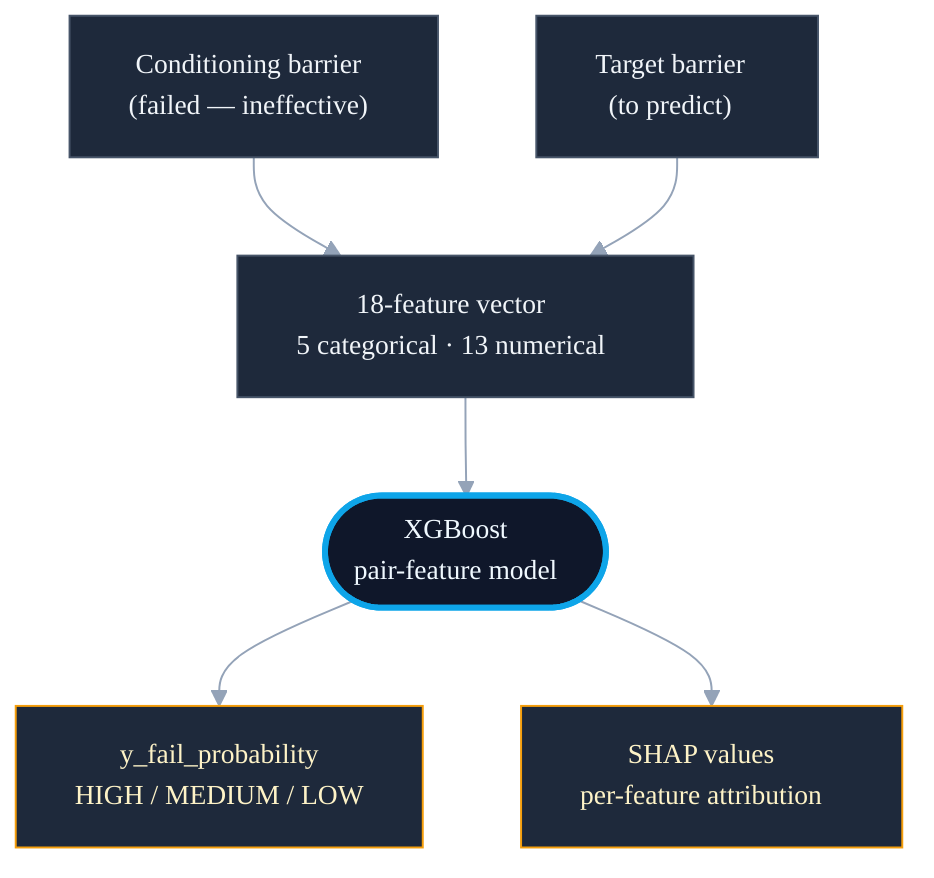

<!--
chapter: 3
title: Pair Features and the Cascade
audience: Process safety domain expert evaluator + faculty supervisor
last-verified: 2026-04-26
wordcount: ~875
-->

# Chapter 3 — Pair Features and the Cascade

## The cascade architectural insight

A single-barrier failure probability carries an implicit assumption: each barrier fails or holds independent of every other. In a Loss of Containment scenario, that assumption does not hold. When a prevention barrier collapses, the threat pathway to the top event is already open; every mitigation barrier downstream now operates in a degraded context the single-barrier model did not represent.

Cascade framing (Khakzad 2013, 2018) addresses this directly: designate one barrier as failed, then estimate failure probability for every other conditioned on that collapse. Chapter 1 introduced the question. The pair-feature architecture operationalizes it — each training example encodes a conditioning barrier and a target barrier together, so the model learns from incident evidence whether that structural relationship predicts failure. D008 documents the architectural pivot.

*Source grounds: `docs/decisions/DECISIONS.md` (D008: cascade pivot decision, Khakzad 2013/2018 process safety methodology anchor, Fidel Comments #12 pathway-awareness, #56 CCPS taxonomy, #63 threat-based)*

## Eighteen features, two barrier vectors

Each training row pairs two barriers from the same incident. The conditioning side carries the barrier designated as failed; the target side carries the barrier being predicted. Both contribute features, making the row a joint representation of a structural relationship rather than a single barrier's properties.

The feature contract totals 18: five categorical (lod_industry_standard and barrier_level on each side, plus barrier_condition_cond — forced to "ineffective" at inference, operationalizing the failure designation) and thirteen numerical (pathway sequence, LoD depth, and threat count at LoD for each side; three incident-level context counts; and four threat-class flags: environmental, electrical, procedural, mechanical). A fifth flag — communication breakdown — is present in the single-barrier parquet but deliberately excluded from the pair-feature contract.

*Source grounds: `src/modeling/cascading/pair_builder.py` (BARRIER_FEATURES_TARGET, BARRIER_FEATURES_COND, CONTEXT_FEATURES; cat_all=5, num_all=13, all_features=18; comment: `2 + 3 + 3 + 3 + 7 = 18`); `src/modeling/cascading/data_prep.py` (ENCODED_FEATURES: 14 items including flag_communication_breakdown; excluded from pair model per KEEP_COLS projection)*

---

---

## GroupKFold training protocol

Cross-join pairing means each incident contributes multiple rows — the same incident's barrier pairs cannot span train and test without leaking incident-specific patterns into the evaluation. GroupKFold(5) on incident_id prevents this: all pairs from any given incident fall entirely into one fold, so the CV evaluates generalization across incidents rather than across pairs.

scale_pos_weight = (1−pos_rate)/pos_rate is computed independently for each CV fold and once for the full-train fit (positive rate at pair level: 0.5535). Hyperparameters: n_estimators=400, max_depth=4, learning_rate=0.05, subsample=0.8, colsample_bytree=0.8, min_child_weight=5. OrdinalEncoder with unknown_value=−1 handles CCPS categories not seen at training — a user-entered scenario can introduce unseen lod_industry_standard values; the model continues rather than crashes.

*Source grounds: `src/modeling/cascading/train.py` (GroupKFold(5) on incident_id; scale_pos_weight per-fold and full-train; _PATRICK_HYPERPARAMETERS dict; OrdinalEncoder handle_unknown="use_encoded_value", unknown_value=−1 in pair_builder.py make_xgb_pipeline)*

## Cross-validation results and the 0.651 fold

Five-fold CV on y_fail_target produced AUC 0.763 ± 0.066. Per-fold values: 0.854, 0.756, 0.792, 0.651, 0.762. The 0.651 fold is the lowest — the other four cluster between 0.756 and 0.854. It is reported directly rather than absorbed into the std summary.

The variance has a structural explanation. GroupKFold assigns all pairs from a given incident to one fold; uneven incident-type distribution across folds is unavoidable at 156 incidents. A fold drawing a higher proportion of atypical incidents — unusual threat configurations, rare CCPS categories — tests a different incident population than the training set. That is the mechanism; it is expected, not evidence of instability.

The mini-gate required mean AUC ≥ 0.70 and every fold ≥ 0.60. All five folds clear 0.60 and all are well above random (0.5); the mean is 0.763. The gate passed.

*Source grounds: `data/models/artifacts/xgb_cascade_y_fail_metadata.json` (cv_scores: mean=0.763012, std=0.066120, per_fold=[0.854336, 0.756277, 0.791978, 0.650613, 0.761857]); `src/modeling/cascading/mini_gate.py` (_AUC_MEAN_THRESHOLD=0.70, _AUC_FOLD_FLOOR=0.60)*

## The y_hf_fail decision (D016 Branch C)

Training ran on both targets. y_fail_target results are above; y_hf_fail_target — predicting whether a barrier failed with human factor contribution — produced AUC 0.556 ± 0.118, with per-fold values including 0.401.

D016 pre-declared three production-surface branches based on measured AUC; D019 tightened them to strict total-ordering with Branch C as catch-all. 0.556 activates Branch C: drop y_hf_fail from the API and UI surface, retain artifacts on disk. The decision required no post-hoc judgment — the measurement determined the outcome.

The root cause is a sample-size ceiling. HF positives appear in 56 of 156 incidents; the remaining 100 contribute only negative labels for this target. D018 re-introduced PIF features into the y_hf_fail training set as an additional test; generalization did not recover.

*Source grounds: `data/models/artifacts/xgb_cascade_y_hf_fail_metadata.json` (cv_mean=0.556171, cv_std=0.118248, per_fold=[0.765, 0.516, 0.401, 0.532, 0.567], s02b_branch="C"); `docs/decisions/DECISIONS.md` (D016: three-branch logic; D019: strict total-ordering, Branch C catch-all; D018: PIF re-introduction for y_hf_fail test)*

## Risk threshold mapping (D006)

A raw probability requires mapping to an operational risk tier. D006 established the active cutpoints: HIGH ≥ 0.70, MEDIUM ≥ 0.45, LOW < 0.45. configs/risk_thresholds.json is the authoritative source; predict.py reads it at load time.

The calibration motivation is domain-specific: probability distributions for user-entered inference scenarios rarely exceed 0.85. Prior training-set quantile cutoffs set the MEDIUM floor above 0.98, making virtually every inference output LOW regardless of structural risk. D006 shifted boundaries to where the inference distribution actually lives.

The model artifact carries a parallel risk_tier_thresholds field — {HIGH:0.66, MEDIUM:0.33} from an earlier calibration. That field is not read at inference and does not reflect D006. It is documentation drift the chapter records rather than corrects.

*Source grounds: `configs/risk_thresholds.json` (D006 active: p60=0.45, p80=0.70; prior p60=0.9801); `src/modeling/cascading/predict.py` (_risk_band() reads thresholds["p80"] and thresholds["p60"] at load); `docs/decisions/DECISIONS.md` (D006); CLAUDE.md (metadata.json risk_tier_thresholds field explicitly unused)*

## What this chapter buys and what it doesn't

Six things are now in place. Cascade framing is operationalized — each training row encodes a barrier pair, not a single barrier. The 18-feature contract is verified against source. GroupKFold CV with incident-grouped folds prevents barrier pairs from the same incident leaking across train and test. AUC 0.763 is reported with per-fold variance, including the lowest fold. y_hf_fail was measured against pre-declared branch logic and excluded, not abandoned. D006 thresholds are authoritative and the metadata-field drift is on record.

## What this chapter buys

- Cascade framing operationalized; pair-feature contract grounds it in code (D008)
- 18-feature pair contract verified against pair_builder.py
- GroupKFold CV with incident-grouped folds prevents leakage
- AUC 0.763 reported with per-fold variance including 0.651
- y_hf_fail excluded by pre-declared branch logic (D016 Branch C)
- D006 thresholds authoritative; metadata drift recorded

## What this chapter doesn't buy

- Whether 813 pairs generalize to unseen incident configurations — logged
- Whether 4 threat-class flags proxy the inference threat landscape — not evaluated
