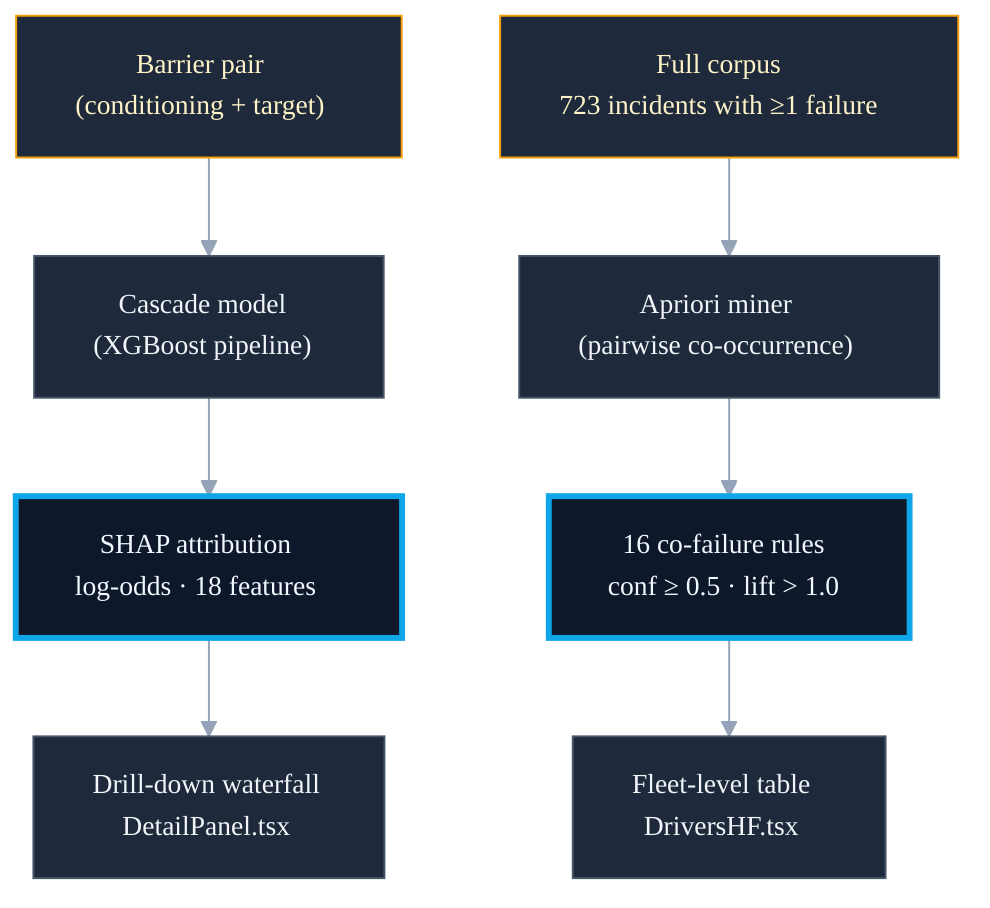

<!--
chapter: 4
title: Two Explanation Signals
audience: Process safety domain expert evaluator + faculty supervisor
last-verified: 2026-04-27
wordcount: ~700
-->

# Chapter 4 — Two Explanation Signals

## Two signals, one question each

The cascade model produces predictions. The incident corpus produces patterns. The system surfaces both — not as a single "explainability" output, but as two signals that answer structurally different questions.

The first is per-prediction: given that a conditioning barrier has been designated as failed, why did the model assign this probability to this target barrier? The answer is specific to this barrier pair, this structural configuration, this feature vector. The second is fleet-level: across the full incident corpus, which barrier families fail together, and with what frequency? The answer is population-level, independent of any specific scenario.

Conflating them produces an incomplete answer to both. The architecture separates them because the questions are separate.

*Source grounds: `src/modeling/cascading/shap_probe.py` (per-prediction SHAP architecture); `scripts/generate_apriori_rules.py` (fleet-level Apriori co-failure architecture)*

## SHAP TreeExplainer: per-prediction attribution

Each SHAP value is an additive contribution in log-odds space — positive values push failure probability up, negative values push it down. Summed with the base value, they recover the model's raw margin prediction for that barrier pair.

The explainer is built in-memory from the XGBClassifier pipeline step at startup and never serialized. The serialization constraint is explicit in the code: a TreeExplainer serialized through a ColumnTransformer round-trip can produce silent feature misalignment. Feature names come from the metadata JSON sidecar at inference, not from `model.feature_names_in_`, which may be None after joblib serialization.

The drill-down waterfall in `DetailPanel.tsx` renders per-prediction SHAP for the selected target barrier. `DriversHF.tsx` computes mean |SHAP| across all predictions for the global importance view.

*Source grounds: `src/modeling/cascading/shap_probe.py` (`build_tree_explainer`, never-serialize contract; `compute_shap_for_record`, margin space, metadata-sidecar feature names); `src/modeling/cascading/predict.py` (`ShapEntry`, `_shap_entries`); `frontend/components/panel/DetailPanel.tsx` (`cascadingShap` waterfall); `frontend/components/dashboard/DriversHF.tsx` (`buildGlobalShapData`, mean |SHAP|); CLAUDE.md (SHAP serialization gotcha)*

## Apriori: fleet-level co-failure rules from the wider corpus

Sixteen rules are mined from 723 incidents — the full schema corpus filtered to incidents with at least one failed barrier, not the 156-incident cascading training subset. The two populations are different by design.

For each incident, the set of barrier families that failed forms a transaction. Pairwise co-occurrence is computed across all transactions; rules are retained at support ≥ 0.05, confidence ≥ 0.5, lift > 1.0. The top rule — communication barriers failing alongside procedures barriers — carries confidence 0.732 and lift 1.423.

`GET /apriori-rules` serves the pre-computed artifact at startup. `AprioriRulesTable` in `DriversHF.tsx` renders the rules sortable by confidence, support, or lift — surfacing patterns in a form an investigator can recognize from prior incident experience, not derived from model attribution.

*Source grounds: `scripts/generate_apriori_rules.py` (pairwise co-occurrence algorithm, thresholds: support ≥ 0.05, confidence ≥ 0.5, lift > 1.0); `data/evaluation/apriori_rules.json` (16 rules, n_incidents=723, top rule: communication → procedures); `src/api/main.py` (`GET /apriori-rules`, startup load from pre-computed artifact); `frontend/components/dashboard/DriversHF.tsx` (`AprioriRulesTable`, sortable by confidence/support/lift)*

---

---

## PIFs: the M002 ablation record and D011

The cascade feature contract embeds a structural hypothesis: barrier failure relationships are determined by type, pathway position, and LoD depth — not by HF-state indicators that are incident-level, not barrier-level. D011 dropped all 12 PIF booleans from the cascade feature set on this basis.

The M002 PIF ablation is the strongest evidence on record for what that exclusion costs. PIF impact on failure prediction was neutral — Model 1 F1 0.885 (with PIFs) vs. 0.884 (without). For human factor sensitivity, impact was material — Model 2 F1 0.696 vs. 0.658. The ablation supports D011's exclusion from the failure-prediction target.

D018 partially reversed D011 for y_hf_fail only, re-introducing 12 PIF _mentioned flags for that run. That target was excluded from production per D016 Branch C. No M003 ablation was run; the M002 evidence is advisory — the populations and feature contracts differ.

*Source grounds: `docs/decisions/DECISIONS.md` (D011: 12 PIF booleans dropped from cascade features, structural hypothesis; D018: partial reversal for y_hf_fail target only); `docs/evaluation/EVALUATION.md` (PIF Ablation Study: Model 1 F1 0.885 vs. 0.884 — neutral; Model 2 F1 0.696 vs. 0.658 — material)*

## What this chapter buys and what it doesn't

Four things are now in place. SHAP attribution in log-odds space surfaces per-prediction — in the drill-down waterfall and as mean |SHAP| global importance. Sixteen Apriori co-failure rules draw from the wider 723-incident corpus, not the cascading training subset. The two signals are separated by design because the questions they answer are structurally different. The M002 PIF ablation provides the supporting evidence for D011's exclusion from failure prediction — and the record for what that exclusion costs.

## What this chapter buys

- SHAP per-prediction attribution: drill-down waterfall and global importance
- 16 Apriori rules from 723 incidents — fleet-level, not cascading subset
- Two signals separated by design: different scopes, different questions
- D011 PIF exclusion supported by M002 ablation (Model 1 neutral)

## What this chapter doesn't buy

- M003-equivalent PIF ablation — sample-size constraint; M002 evidence advisory
- SHAP feature stability across folds — not evaluated
