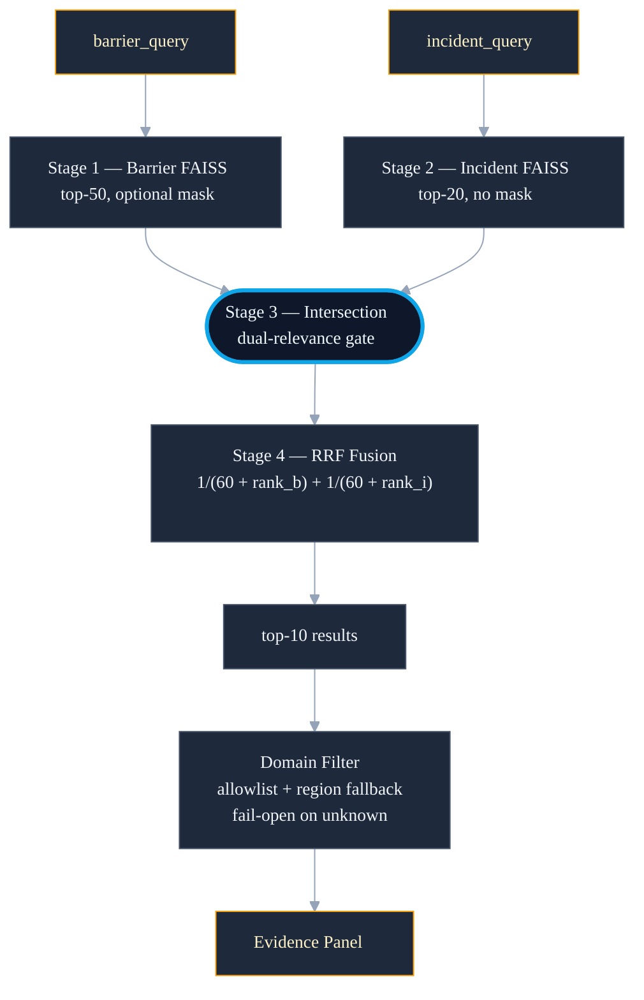

<!--
chapter: 5
title: Retrieval, Scoping, and the Domain Filter
audience: Process safety domain expert evaluator + faculty supervisor
last-verified: 2026-04-26
wordcount: ~1,100
-->

# Chapter 5 — Retrieval, Scoping, and the Domain Filter

## What this layer does and does not do

Two components implement the evidence pipeline. `RAGAgent.explain()` retrieves — it returns a ranked list of barriers and incidents from the corpus, together with structured context text, and stops there. `BarrierExplainer` synthesizes — it wraps retrieval output with an LLM call and produces the narrative surfaced in the evidence panel. This chapter is concerned with the retrieval half.

The separation is architectural, not incidental. Retrieval is deterministic: identical queries produce identical results. Synthesis is not: it carries temperature, token sampling, and prompt sensitivity as independent failure modes. Governing them separately makes each independently testable. Retrieval failure — the 40% miss rate measured in the gold-set evaluation — is a property of the corpus and the embedding model. That distinction matters for diagnosis.

## Building the searchable corpus

Each incident record produces two indexed documents: one at barrier level, one at incident level. `compose_barrier_text()` assembles the barrier embedding text — name, role, line of defense, family assignment, and PIF flags — into a single string. `build_barrier_documents()` and `build_incident_documents()` write the two CSVs (27 columns and 11 columns respectively) from which the indexes are built. The v2 ingestion added two previously unused Schema V2.3 fields: `pifs.*._value` text blocks, which carry per-PIF context descriptions, and `event.recommendations`, which carry investigation-derived corrective actions (D017).

Both document sets are embedded with `all-mpnet-base-v2` (768 dimensions). Vectors are L2-normalized at build time (tolerance 1e-4) and stored in two FAISS `IndexFlatIP` indexes — barrier and incident — under `data/rag/v2/`. Inner product on normalized vectors is cosine similarity; FAISS performs exact search, no approximation.

## Scoping retrieval to match training

A model trained on a broad incident corpus learns failure patterns that transfer across configurations. Retrieval is held to a different standard: when an incident appears as evidence for a prediction, it has to come from the same population the model was trained against.

The v1 corpus spanned 526 incidents and 3,253 barriers. The v2 corpus narrows to 156 incidents and 1,161 barriers — precisely the training set encoded in `cascading_training.parquet`. The narrowing is deliberate (D017): `scripts/build_rag_v2.py` reads the parquet at build time and applies the incident ID filter directly to corpus construction.

Corpus scoping is the first line of domain alignment; the same principle requires a second enforcement at query time, described in Section 5.

## The four-stage retrieval pipeline

Retrieving relevant barriers requires matching two independent dimensions simultaneously: a barrier must resemble the query barrier, and its parent incident must resemble the query scenario.

Stage 1 searches the barrier index (top 50, `IndexFlatIP`, cosine similarity on 768-dim vectors). An optional boolean mask — by barrier family, human failure flag, or PIF dimension — can narrow the candidate pool before search. Stage 2 searches the incident index independently (top 20, no mask). Stage 3 intersects: only barriers whose parent incident appears in the Stage 2 results pass forward. Stage 4 fuses ranks via Reciprocal Rank Fusion — `1/(60 + barrier_rank) + 1/(60 + incident_rank)`, k=60 — and truncates to top-10.

The intersection enforces dual relevance; a single-index score cannot replicate it.

---

---

## Confining results to domain prior art

The model benefits from a broad incident corpus because failure patterns recur across industries regardless of sector. Evidence panels serve a different function: they supply domain-specific prior art that a process safety evaluator can recognize as relevant. The two requirements pull in opposite directions, so they are enforced at different stages.

The domain filter runs post-retrieval, after Stage 4. The `OIL_GAS_AGENCY_ALLOWLIST` constant is defined as `{BSEE, TSB, PHMSA}` — a forward-looking definition of oil-and-gas-domain agencies — but the active corpus contains only BSEE and CSB extractions, so at present the filter effectively passes BSEE-sourced incidents and drops CSB-sourced ones. Documents missing agency metadata fall through to a region-keyword check (Gulf, offshore, North Sea, Alaska). Incidents matching neither condition fail open — they pass rather than disappear, since suppressing unknown incidents would silently degrade recall. A composite `(incident_id, control_id)` key replaced the legacy `control_id`-only lookup in the same commit.

The motivation was concrete. Pre-demo verification showed AB Specialty Silicones — a chemical batch tank rupture in Waukegan, Illinois — appearing as evidence for offshore PSV barrier predictions. The diagnosis identified two causes operating together: the bi-encoder matched chemical-plant barrier failures with offshore ones because both abstract to the same pattern (barrier failed → catastrophic release), and control IDs C-001 through C-010 are reused across incidents, so a `control_id`-only lookup returned metadata from the wrong incident's barrier. The fix landed at commit e182f53.

Training breadth and retrieval specificity are not in tension — they are separate design choices serving different requirements at different stages of the pipeline. The model sees more; the evidence panel returns less, but the right less.

## What the evaluation measured and where recall fails

A 50-query gold set — each query paired with a target barrier family — produced the following baseline metrics: Top-1=0.30, Top-5=0.56, Top-10=0.62, MRR=0.40. A cross-encoder reranker (ms-marco-MiniLM-L-6-v2, 22M parameters) was evaluated against the same harness. It produced +3.1% MRR improvement. A threshold of +5% MRR had been declared before measurement as the condition for default-on enablement; the reranker fell short. It remains optional and disabled by default.

The empirical finding with the larger consequence is the miss rate: 20 of 50 queries returned no correct result in either the baseline or the reranked system. Reranking cannot recover results that were never retrieved. The system's constraint is recall — the 40% of queries the corpus and the embedding model together could not satisfy — not ranking within the results that were retrieved.

## What this chapter buys and what it doesn't

Five things are now in place. The retrieval and synthesis layers are architecturally separated — deterministic recall on one side, LLM generation on the other — making each independently testable. The two-index pipeline enforces dual relevance through the Stage 3 intersection: a result must independently match both barrier and incident queries. The v2 corpus is scoped to the 156-incident training set, aligning retrieval evidence with the model's training population. A post-retrieval domain filter confines results to oil-and-gas prior art, failing open on unknown agencies. The reranker decision was made against a pre-declared threshold, not post-hoc.

The 40% miss rate is an open constraint; corpus expansion is the recall path, logged in the post-deployment fix list. The +3.1% MRR result is bounded by the current ~1,200-barrier corpus; reranker conclusions are corpus-size-gated.

---

## What this chapter buys

- Retrieval-synthesis architectural separation; each layer independently testable.
- Two-index pipeline with Stage 3 dual-relevance gate.
- v2 corpus scoped to 156-incident model training set.
- Post-retrieval domain filter; fails open on unknown agencies.
- Reranker decision against a pre-declared threshold, not post-hoc.

## What this chapter doesn't buy

- 40% miss rate: logged in the post-deployment fix list.
- Reranker default-on conclusions are corpus-size-gated.
