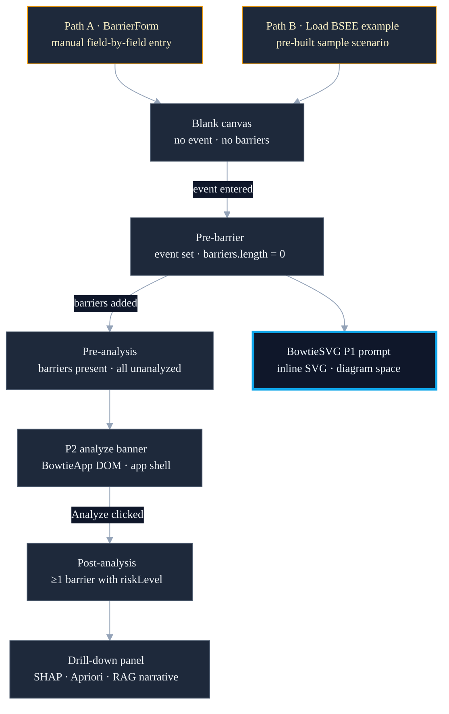

<!--
chapter: 6
title: Two Entry Paths and Four Implicit States
audience: Process safety domain expert evaluator + faculty supervisor
last-verified: 2026-04-27
wordcount: ~880
-->

# Chapter 6 — Two Entry Paths and Four Implicit States

## Two entry paths

A process safety engineer evaluating a known scenario needs to enter it field by field — side, name, type, family, role, line of defense — building the Bowtie from investigation context. An evaluator or new user arriving without a prepared scenario needs something runnable immediately. Both moments are real; the system accommodates both.

Path A is the BarrierForm sidebar: manual field-by-field entry, side toggle (prevention/mitigation), name, barrier type and family, role, and LoD. Path B is "Load BSEE example": a single button call to `loadBSEEExample()` that populates a complete pre-built scenario. Path A represents the production use case. Path B serves onboarding, demonstration, and as a reference scenario for users learning the tool.

*Source grounds: `frontend/components/BowtieApp.tsx` (`loadBSEEExample()`); `frontend/components/sidebar/BarrierForm.tsx` (side toggle, name, type, family, role, lod fields)*

## Four UI states derived from context

The user progresses through four behavioral states: blank canvas (no event, no barriers), pre-barrier (event description set, no barriers added), pre-analysis (barriers present and all unanalyzed), and post-analysis (at least one barrier carrying a riskLevel). No state-machine enum implements this in production code. The states are derived from three context values — whether `topEvent` is set, `barriers.length`, and whether any barrier has a non-unanalyzed `riskLevel` — and the UI renders against those conditions directly.

The approach works because the three values are sufficient. A formal enum would add a name for each combination; the same conditions would still drive the transitions. `P2Banner.test.tsx` documents the four states using P0/P1/P2/P3 vocabulary — that is the documentation surface for them, not a production naming convention.

*Source grounds: `frontend/context/BowtieContext.tsx` (`topEvent`, `barriers`, barrier `riskLevel` state values); `frontend/components/BowtieApp.tsx` (state-derived rendering); `frontend/__tests__/P2Banner.test.tsx` (P0/P1/P2/P3 test vocabulary documenting the four states)*

## State transitions: two rendering mechanisms

The pre-barrier and pre-analysis transitions surface through mechanisms that live in different parts of the component tree — and the placement is structural, not arbitrary.

When the event description is set but no barriers have been added, an SVG `<text>` element (`data-testid="p1-barrier-prompt"`) renders inline inside `BowtieSVG`, occupying the prevention zone of the diagram canvas. It appears as part of the diagram because it belongs to diagram space — a positional cue, not a modal or overlay.

When barriers are present but all unanalyzed, a DOM element (`data-testid="p2-analyze-banner"`) renders in `BowtieApp.tsx`, outside the diagram entirely. It applies globally regardless of diagram state — a call to action at the app-shell level, not scoped to what the diagram is currently showing.

*Source grounds: `frontend/components/diagram/BowtieSVG.tsx` (`p1-barrier-prompt` SVG text element, prevention zone); `frontend/components/BowtieApp.tsx` (`p2-analyze-banner` DOM element); commits `d9f0e39` (P1 prompt added to BowtieSVG), `1d58718` (P2 banner and grey barriers wired)*

---

---

## The custom BowtieSVG component

BowTieXP visual fidelity requires specific barrier geometry, pathway curve style, and layout constants derived from a reference HTML mockup. A generic graph library's node/edge model accommodates custom rendering, but meeting the specificity of the reference design through workarounds would produce brittle layout logic. A pure SVG component replaced React Flow — the constraint was visual specificity; custom SVG met it directly.

The component is 752 lines. `computeLayout()` positions threats, consequences, and barriers from canvas constants extracted from `bowtie-reference-v4.html`; cubic bezier curves connect them through the top-event circle. Risk-band coloring is barrier-level: grey (`#9CA3AF`/`#D1D5DB`) when `risk_level` is null, red/orange/green when assessed. The layout engine runs inside `useMemo` — recomputes only when threats, consequences, or barriers change.

*Source grounds: `frontend/components/diagram/BowtieSVG.tsx` (752 lines; `computeLayout()`; risk-band coloring on `risk_level`; `useMemo` layout); commit `a8323bc` (React Flow replacement); `docs/evidence/reference/bowtie-reference-v4.html` (visual reference for layout constants)*

## The SVG coordinate verification gate

The Vitest suite covers behavior — click handlers, `data-testid` element presence, text rendering. It does not cover visual geometry. A layout constant change to `ROW_H`, `TOP_EVENT_R`, or the barrier zone calculations will produce a valid test run and a broken diagram if the coordinates are wrong.

Manual browser verification is required for any BowtieSVG geometry change. K001 and K002 record this as an explicit constraint. No automated visual regression layer exists. The tradeoff was accepted as part of the custom-SVG choice — visual layout becomes implementation work, not library work, and the test suite cannot validate it. The constraint does not resolve; it is the engineering reality of owning a bespoke layout engine.

*Source grounds: `frontend/components/diagram/BowtieSVG.tsx` (layout constants: `ROW_H`, `TOP_EVENT_R`, zone calculations); `docs/knowledge/KNOWLEDGE.md` (K001, K002: manual browser verification required for BowtieSVG coordinate changes)*

## Drill-down panel composition

The SHAP waterfall and Apriori co-failure table described in Chapter 4 compose into the per-barrier drill-down panel alongside the RAG narrative. Each signal remains what it was — per-prediction attribution, fleet-level rules, retrieved evidence — assembled at barrier-selection time.

`useAnalyzeCascading` fires `/predict-cascading` and `/rank-targets` in parallel on conditioning-barrier click, debounced at 300ms. Predictions are sorted by `composite_risk_score` from the ranking response, falling back to `y_fail_probability` when a target is absent from the ranked list. `useExplainCascading` fires `/explain-cascading` with an AbortController — any in-flight request is cancelled when the user selects a different target barrier.

When the narrative is unavailable, the panel renders the deterministic SHAP and Apriori surfaces and omits the narrative section. The user still receives explanation from both deterministic signals.

*Source grounds: `frontend/components/panel/DetailPanel.tsx` (SHAP waterfall composition); `frontend/components/dashboard/DriversHF.tsx` (`AprioriRulesTable`); `frontend/hooks/useAnalyzeCascading.ts` (parallel fetch, 300ms debounce, `composite_risk_score` sort); `frontend/hooks/useExplainCascading.ts` (AbortController cancellation, `narrativeUnavailable` flag)*

---

## What this chapter buys and what it doesn't

Six things are now in place. Two entry paths serve distinct user moments — manual field-by-field entry for scenario authoring, sample loading for onboarding and demonstration. Four behavioral UI states are documented against their context-value conditions, not against a state-machine enum. The two rendering mechanisms split by structural logic: the pre-barrier prompt lives inside the diagram; the pre-analysis banner lives in the app shell. Custom SVG replaced React Flow to meet BowTieXP visual fidelity requirements. The SVG coordinate verification gate is acknowledged as an engineering reality, not a gap to resolve. Drill-down panel composition assembles Chapter 4's explanation signals with parallel-fetch hooks and AbortController cancellation.

## What this chapter buys

- Two-path entry (manual + sample) for distinct user moments
- Four behavioral UI states derived from context, not a state-machine enum
- Two rendering mechanisms split structurally: diagram space vs. app shell
- Custom BowtieSVG for BowTieXP visual fidelity (computeLayout, risk-band coloring)
- SVG coordinate gate (K001/K002) acknowledged as engineering reality
- Drill-down composition: parallel-fetch hooks, composite_risk_score sort, AbortController cancellation

## What this chapter doesn't buy

- Automated visual regression for SVG geometry — not built
- Cross-browser layout validation across all viewport sizes — not exhaustively tested
