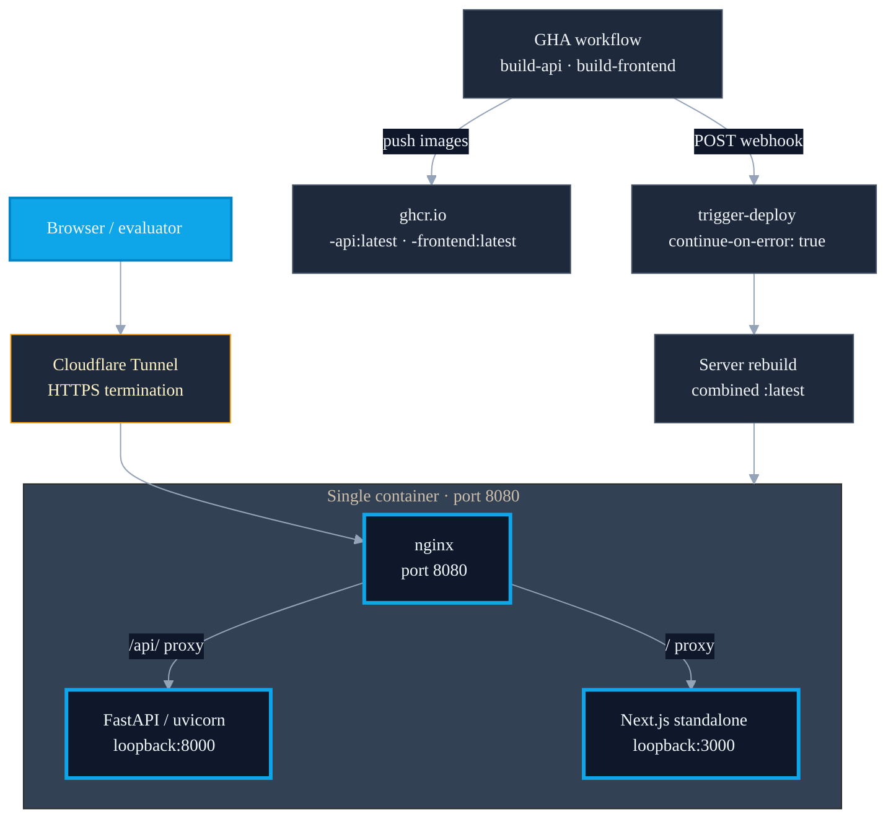

<!--
chapter: 7
title: Self-Hosted Deployment and Its Trade-Offs
audience: Process safety domain expert evaluator + faculty supervisor
last-verified: 2026-04-27
wordcount: ~575
-->

# Chapter 7 — Self-Hosted Deployment and Its Trade-Offs

## Why self-hosted Ubuntu

Streamlit Community Cloud was the prescribed academic deployment target. The architecture — FastAPI backend, Next.js frontend — is not hostable there; the platform supports Python apps, not a two-process stack requiring a separate Node.js runtime. D007 records the decision: self-hosted Ubuntu 24.04 mini-PC, Docker, Cloudflare Tunnel providing HTTPS without port-forwarding or a public IP.

The approach carries a single-point-of-failure risk on demo day. D007 acknowledges it; the active fallback is that local Docker Compose remains runnable — the demo can be served from any machine with Docker installed if the tunnel is unavailable.

---

*Source grounds: `docs/decisions/DECISIONS.md` (D007: self-hosting over Streamlit Community Cloud; Ubuntu 24.04; Cloudflare Tunnel; single-point-of-failure acknowledged; fallback = local compose runnable)*

## The single-container architecture

One container runs the full stack. start.sh launches three processes in sequence — uvicorn on loopback:8000, the Next.js standalone server, then nginx in the foreground. nginx proxies /api/ to loopback:8000 and all other routes to loopback:3000; there is no inter-container networking at the proxy layer.

Local development runs three separate Docker Compose services — api, frontend, nginx — with nginx resolving the other two by Docker service name. Production runs a single combined container built from the root Dockerfile. The two configurations serve different workflows but share the same nginx routing logic, differing only in whether the upstream targets are loopback addresses or Docker DNS names.

---

*Source grounds: root `Dockerfile` (combined two-stage build: Node frontend-build → Python production); `deploy/start.sh` (uvicorn → node → sleep 3 → nginx foreground); `deploy/nginx.conf` (proxy_pass to 127.0.0.1:8000 and 127.0.0.1:3000); `deploy/docker-compose.server.yml` (single `bowtie` service, port 8080:8080); root `docker-compose.yml` (three services: api, frontend, nginx; Docker DNS upstream)*

## Container engineering choices

Four choices shape the production image. TRANSFORMERS_OFFLINE=1 and HF_HUB_OFFLINE=1 prevent the runtime from attempting network downloads — all-mpnet-base-v2 is pre-downloaded during the builder stage and copied into the runtime layer. Model artifacts and RAG indexes are baked into the image at build time rather than mounted, eliminating a runtime file-system dependency at the cost of a larger image. The healthcheck start_period is 60 seconds — XGBoost and FAISS initialization account for most of that window before the API can respond to /health. NEXT_PUBLIC_API_URL is baked into the Next.js build output via a build ARG; the default targets the production URL, and an override at build time is available for local smoke testing.

---

*Source grounds: `deploy/Dockerfile.api` (TRANSFORMERS_OFFLINE=1, HF_HUB_OFFLINE=1, HF_HOME=/opt/hf_cache pre-downloaded in builder stage; model artifacts COPY at build time: data/models/artifacts, data/rag/v2, data/evaluation/apriori_rules.json; HEALTHCHECK start_period=60s); `deploy/Dockerfile.frontend` (ARG NEXT_PUBLIC_API_URL=https://bowtie-api.gnsr.dev; HEALTHCHECK start_period=30s)*

## The deployment pipeline

A push to main triggers the GHA workflow. Two build jobs run in parallel — one for the API image, one for the frontend — pushing tagged images to ghcr.io with -api and -frontend suffixes. A third job then POSTs to a webhook on the production server; that step runs with `continue-on-error: true`, decoupling GHA build success from production deployment success.

The webhook triggers a local rebuild and container restart on the server — producing the combined :latest image that docker-compose.server.yml actually consumes. The -api and -frontend images pushed by GHA are deployment artifacts the production stack does not currently pull. Manual SSH access serves as fallback.

---

*Source grounds: `.github/workflows/deploy.yml` (build-api job, build-frontend job, trigger-deploy with `continue-on-error: true`; POST to `https://bowtie-deploy.gnsr.dev/hooks/bowtie-analytics`); `deploy/docker-compose.server.yml` (image: `ghcr.io/sr-dotcom/bowtie-risk-analytics-oilgas:latest` — combined tag, not the -api/-frontend GHA tags)*

---

---

## What this chapter buys and what it doesn't

Four things are now in place. D007 records the self-hosting decision with the active local-compose fallback. The production architecture is documented as a single combined container — start.sh sequencing uvicorn → Next.js → nginx, not Compose service dependencies. Container engineering choices (offline-mode flags, model artifact bake at build, 60-second healthcheck start_period) are grounded in source. The deployment pipeline is described including the continue-on-error decoupling between GHA build success and production deployment.

## What this chapter buys

- D007 self-hosting decision recorded with active local-compose fallback
- Single-container production architecture documented against actual mechanism
- Container engineering choices grounded in source (offline mode, baked artifacts, 60s healthcheck)
- Deployment pipeline described including continue-on-error decoupling

## What this chapter doesn't buy

- High availability, multi-region, or staged rollout — single server with acknowledged SPOF
- GHA-built per-service images not currently consumed by production — flagged for follow-up
